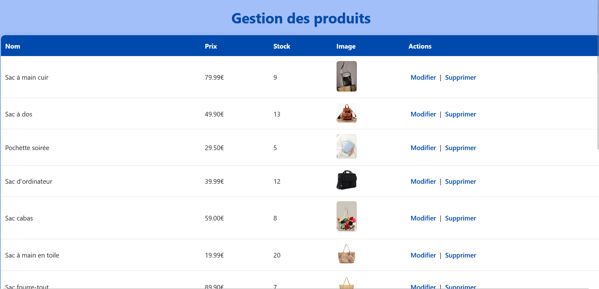
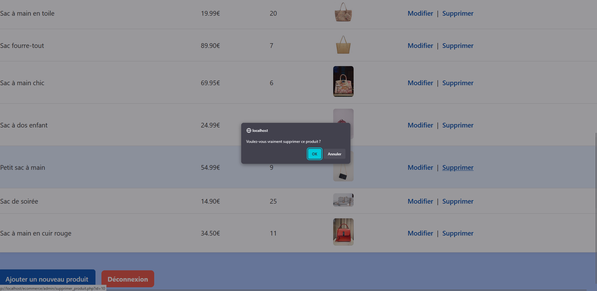

# 🛍️ E-commerce Website (PHP)

An e-commerce platform built with PHP (v8.2.12) featuring user management (clients/admin), shopping cart, order processing, and admin interface.

---

## 📸 Visual Overview

### 🏠 Home Page  

### 🔐 Login  

### 🛒 Cart  
  

### 🛠️ Admin Interface  
  
  

### ⚠️ Action Confirmations  

---

## ✅ Main Features

- User registration, login, and session management  
- Add to cart with **stock availability checks**  
- Order placement  
- Admin panel:
  - Add / update / delete products  
- Confirmation prompts for critical actions  
- Server-side form validation during registration  

---

## 🗂️ Project Structure

/admin/ → Admin functions
/client/ → Client-side logic
/include/ → Database connection (db_connect.php)
/images/ → Product images
/css/ → Stylesheets
/js/ → JavaScript files
index.php → Homepage
accueil_client.php → Logged-in homepage
connexion.php → Login
inscription.php → Sign up
deconnexion.php → Logout

---

## 📝 Notes

- The **“Add to cart”** button is always visible, but additions are blocked if the item is out of stock.  
- All **sensitive actions** (e.g. deletion, logout) are confirmed by the user.  
- Form validation is performed server-side to ensure data integrity.
