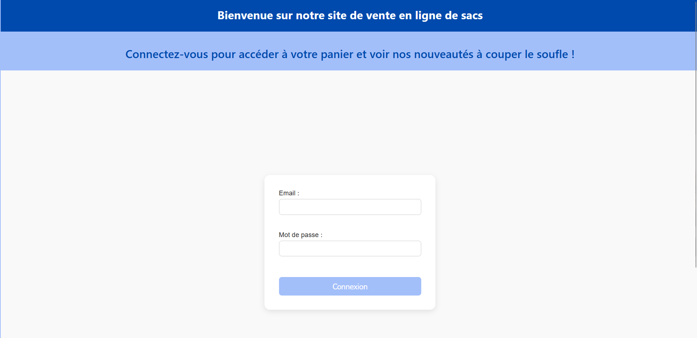
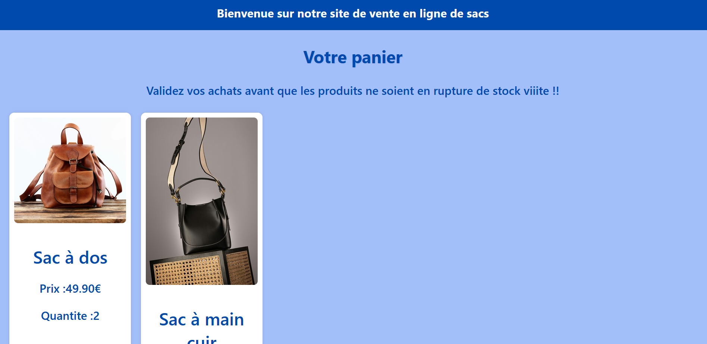
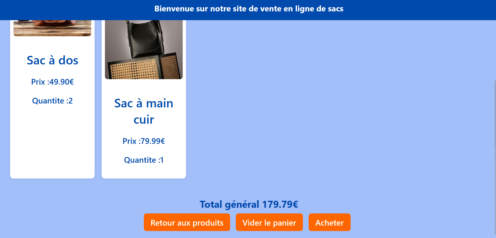
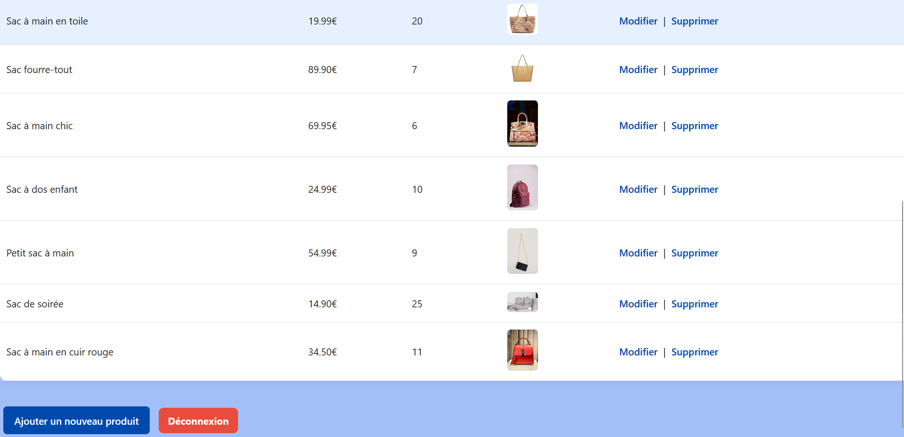
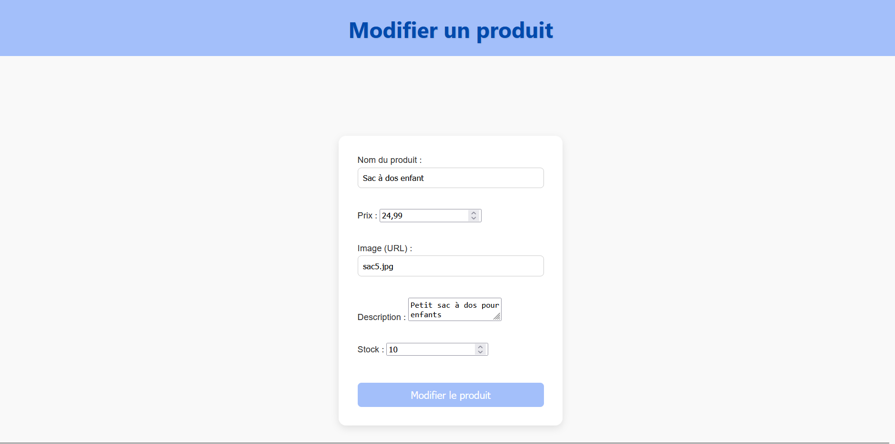

# Site-e-commerce

Description
Site e-commerce en PHP (v8.2.12) avec gestion des utilisateurs (clients/admin), panier, et gestion des produits.
## 📸 Aperçu visuel

### 🏠 Page d'accueil

### 🔐 Connexion

### 🛒 Panier

### 🛠️ Admin

### ⚠️ Confirmations lors d'actions sensibles

Fonctionnalités
Inscription, connexion, gestion des sessions

Ajout au panier avec vérification du stock

Passage de commande

Interface admin pour ajouter/modifier/supprimer des produits

Structure
bash
Copier
Modifier
/admin/ (fonctions admin)  
/client/ (fonctions clients)  
/include/db_connect.php (connexion BDD)  
/images/ (images produits)  
/css/ (styles)  
/js/ (scripts)  
index.php (accueil)  
accueil_client.php (accueil connecté)  
connexion.php / inscription.php / deconnexion.php  

Remarques
Le bouton “Ajouter au panier” est toujours visible, mais l’ajout est bloqué si le produit est en rupture de stock.

Une validation des champs est réalisée côté serveur lors de l’inscription.

Toutes les actions critiques sont confirmées par des messages à l’utilisateur.

